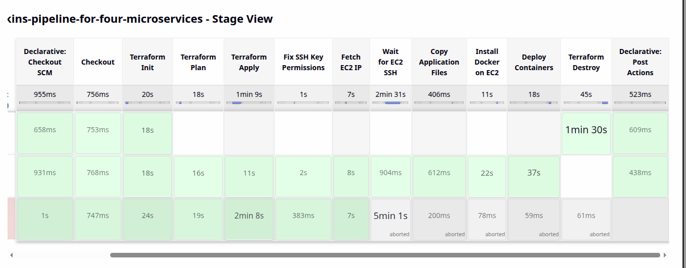
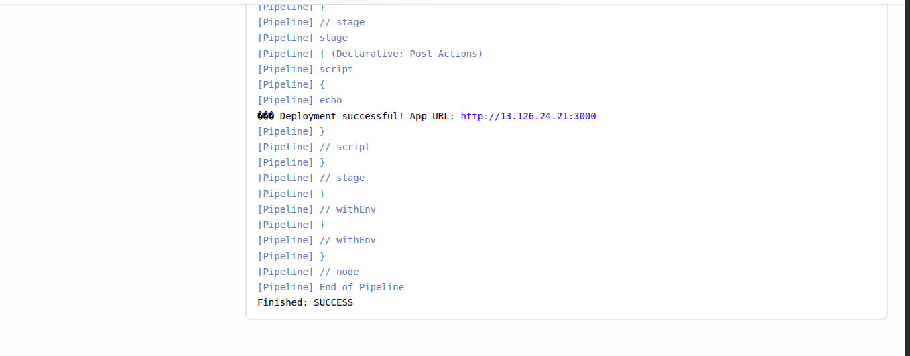
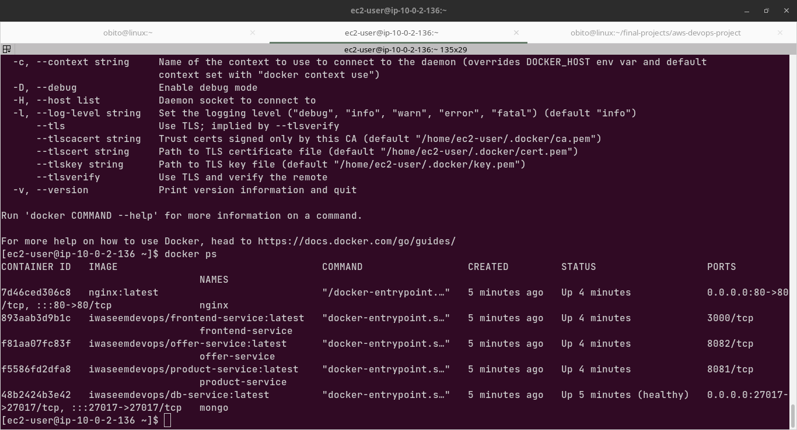

# DevOps Microservices Infrastructure & CI/CD Pipeline

> **Full project walkthrough video (41 min):** [Watch on YouTube](https://www.youtube.com/watch?v=l08tL49kzO0)

A production-grade DevOps project demonstrating complete end-to-end automation — from infrastructure provisioning to live microservices deployment — using Terraform, Jenkins, Docker, and AWS.

---

## Live Demo Screenshots

### Jenkins Pipeline — All Stages Green



### Pipeline Success — Live EC2 App URL



### All Containers Running on EC2



---

## Architecture Overview

```
                         ┌─────────────────────────────────────┐
                         │         GitHub Repository            │
                         │   (code push triggers pipeline)      │
                         └────────────────┬────────────────────┘
                                          │ webhook
                                          ▼
┌─────────────────────────────────────────────────────────────────┐
│                    Jenkins Server (24/7)                         │
│              Provisioned by terraform-infra/                     │
│                    AWS EC2 — Always On                           │
└────────────────────────┬────────────────────────────────────────┘
                         │ runs pipeline
                         ▼
         ┌───────────────────────────────┐
         │     Jenkins CI/CD Pipeline    │
         │                               │
         │  1. Checkout code             │
         │  2. Terraform Init            │
         │  3. Terraform Plan            │
         │  4. Terraform Apply ──────────┼──► Provisions App EC2 on AWS
         │  5. Fix SSH Key Permissions   │         (terraform-app/)
         │  6. Fetch EC2 IP             │
         │  7. Wait for SSH Ready        │
         │  8. Copy docker-compose       │
         │  9. Install Docker on EC2     │
         │  10. Deploy Containers        │
         └───────────────────────────────┘
                         │
                         ▼
┌─────────────────────────────────────────────────────────────────┐
│                 App EC2 Instance (AWS)                           │
│              Provisioned by terraform-app/                       │
│                                                                  │
│   ┌──────────┐   ┌──────────────┐   ┌──────────────┐           │
│   │  Nginx   │──►│   Frontend   │   │Product Service│           │
│   │ :80/:443 │   │   :3000      │   │    :8081      │           │
│   └──────────┘   └──────────────┘   └──────────────┘           │
│                  ┌──────────────┐   ┌──────────────┐           │
│                  │Offer Service │   │  DB Service  │           │
│                  │    :8082     │   │ MongoDB:27017 │           │
│                  └──────────────┘   └──────────────┘           │
└─────────────────────────────────────────────────────────────────┘
```

---

## Two Separate Terraform Infrastructures

This project uses **two completely independent Terraform configurations** — a real-world pattern for separating persistent and ephemeral infrastructure.

### Infrastructure 1 — Jenkins Server (`terraform-infra/`)

- **Purpose:** Runs 24/7 to host Jenkins and trigger pipelines
- **Type:** Permanent — never destroyed
- **Resources:** EC2 instance, VPC, security group, IAM role

### Infrastructure 2 — App Server (`terraform-app/`)

- **Purpose:** Hosts the microservices application
- **Type:** Ephemeral — provisioned per deployment, destroyed after use
- **Resources:** EC2 instance, VPC, security groups, key pair

> **Why two infrastructures?** Jenkins must always be running to receive webhooks and trigger pipelines. The app infrastructure can be created on demand and destroyed when not needed — eliminating AWS costs between deployments. This reflects real-world cost optimization.

---

## Important: Jenkins IP → App Security Group

After provisioning Jenkins infrastructure, you must add the Jenkins server's public IP to the app infrastructure security group. This allows Jenkins to SSH into the app EC2 instance during deployment.

**Step 1 — Get Jenkins server public IP after `terraform apply`:**

```bash
cd terraform-infra/
terraform output jenkins_public_ip
# Example output: 15.206.66.8
```

**Step 2 — Update app infrastructure security group in `terraform-app/`:**

```hcl
# terraform-app/envs/dev/main.tf or modules/security-group/main.tf

cidr_blocks = ["15.206.66.8/32"]   # Replace with your Jenkins server's public IP
```

> This step is shown in detail in the [video walkthrough](https://www.youtube.com/watch?v=l08tL49kzO0) at the infrastructure setup section. **If you skip this step, the pipeline will fail at the SSH stage.**

**Step 3 — Re-run terraform apply for app infra:**

```bash
cd terraform-app/envs/dev/
terraform apply -var='key_name=your-key-name'
```

---

## Microservices

| Service         | Docker Image                            | Port  | Description                 |
| --------------- | --------------------------------------- | ----- | --------------------------- |
| Frontend        | `iwaseemdevops/frontend-service:latest` | 3000  | React-based UI              |
| Product Service | `iwaseemdevops/product-service:latest`  | 8081  | Product catalog API         |
| Offer Service   | `iwaseemdevops/offer-service:latest`    | 8082  | Discounts and offers API    |
| DB Service      | `iwaseemdevops/db-service:latest`       | 27017 | MongoDB (with health check) |
| Nginx           | `nginx:latest`                          | 80    | Reverse proxy               |

All images are publicly available on Docker Hub under `iwaseemdevops/`.

---

## Jenkins Pipeline Stages

```
Declarative: Checkout SCM
        ↓
Checkout                     (pulls latest code from GitHub)
        ↓
Terraform Init               (~20s — initializes providers)
        ↓
Terraform Plan               (~18s — shows infrastructure changes)
        ↓
Terraform Apply              (~1min 9s — provisions EC2 on AWS)
        ↓
Fix SSH Key Permissions      (chmod 400 on generated .pem file)
        ↓
Fetch EC2 IP                 (terraform output -raw app_server_public_ip)
        ↓
Wait for EC2 SSH             (~2min 31s — nc -zv loop until port 22 ready)
        ↓
Copy Application Files       (scp docker-compose.yaml to EC2)
        ↓
Install Docker on EC2        (amazon-linux-extras + docker-compose)
        ↓
Deploy Containers            (docker-compose pull + up -d)
        ↓
Declarative: Post Actions    (prints live app URL)

Finished: SUCCESS ✅
App URL: http://<EC2_PUBLIC_IP>:3000
```

---

## Tech Stack

| Category      | Tools                                                       |
| ------------- | ----------------------------------------------------------- |
| CI/CD         | Jenkins (declarative pipeline, parameterized builds)        |
| IaC           | Terraform (modular — separate Jenkins + App infrastructure) |
| Containers    | Docker, docker-compose                                      |
| Cloud         | AWS EC2, VPC, Security Groups, IAM, key pairs               |
| Reverse Proxy | Nginx                                                       |
| Registry      | Docker Hub                                                  |
| OS            | Amazon Linux 2 (EC2), Ubuntu (Jenkins local)                |
| Scripting     | Bash, Shell                                                 |

---

## Key Engineering Decisions

**Parameterized DESTROY mode**
The pipeline accepts a `DESTROY` boolean parameter. When true, only Terraform Init and Destroy stages execute — tearing down all app infrastructure with a single pipeline run. No manual console access needed.

**Dynamic EC2 IP fetching**
After `terraform apply`, the pipeline fetches the app server IP directly from Terraform output using `terraform output -raw app_server_public_ip`. No hardcoded IPs anywhere in the pipeline.

**SSH readiness wait loop**
Fresh EC2 instances take 1-3 minutes before SSH is available. The pipeline uses a `waitUntil` loop with `nc -zv` checking port 22 every 10 seconds, with a 5-minute timeout. This prevents race conditions that break naive pipelines.

**Secure credential management**
AWS credentials are injected via Jenkins `withCredentials` using `AmazonWebServicesCredentialsBinding`. No AWS keys appear anywhere in the code or pipeline logs.

**Cost optimization**
App infrastructure is provisioned per deployment and destroyed after use. Jenkins infrastructure is always-on but minimal (t3.micro). And app infra on t3.small Total AWS cost for this project: 4$ max using Free Tier + two ec2

---

## How to Run This Project

### Prerequisites

- AWS account (Free Tier sufficient) but it will cost you 2$ to 4$
- Jenkins server running (use `terraform-infra/` below to provision)
- AWS credentials configured in Jenkins as credential ID `aws-creds`
- EC2 key pair created in AWS (note the name)

---

### Step 1 — Provision Jenkins Infrastructure

```bash
cd terraform-infra/
terraform init
terraform plan
terraform apply
```

Note the Jenkins server public IP from the output. You will need it in Step 2.

---

### Step 2 — Update App Security Group with Jenkins IP

Open `terraform-app/` and find the security group that allows SSH access. Update the CIDR block with your Jenkins server's IP:

```hcl
cidr_blocks = ["15.206.66.8/32"]   # Replace with your Jenkins server's public IP address
```

> See the [video walkthrough](youtube.com/watch?v=l08tL49kzO0&feature=youtu.be)

---

### Step 3 — Configure Jenkins

1. Install required plugins: Terraform, Pipeline, AWS Credentials, Git
2. Add AWS credentials with ID `aws-creds`
3. Create a new Pipeline job
4. Set Source as "Pipeline script from SCM"
5. Point to this repository, branch `main`

---

### Step 4 — Run the Pipeline

```
DESTROY = false
KEY_NAME = your-ec2-key-pair-name
```

Run the pipeline. On success you will see:

```
✅ Deployment successful! App URL: http://<EC2_IP>:3000 or nginx http://<EC2_IP>
```

---

### Step 5 — Verify Deployment on EC2

After pipeline success, SSH into the app EC2 instance to verify all containers:

```bash
# Copy the SSH key generated by Terraform during the pipeline run
sudo cp "/var/lib/jenkins/workspace/DevOps Microservices Infrastructure Pipeline/terraform-app/envs/dev/app-key.pem" ~/app-key.pem

# Set correct permissions
sudo chmod 400 ~/app-key.pem

# Fix ownership
sudo chown ec2-user:ec2-user ~/app-key.pem

# SSH into the app EC2 instance
ssh -i ~/app-key.pem ec2-user@<APP_EC2_IP>

# Verify all 5 containers are running
docker ps
```

**Expected output:**

```
CONTAINER ID   IMAGE                                    STATUS
7d46ced306c8   nginx:latest                             Up X minutes
893aab3d9b1c   iwaseemdevops/frontend-service:latest   Up X minutes
f81aa07fc83f   iwaseemdevops/offer-service:latest      Up X minutes
f5586fd2dfa8   iwaseemdevops/product-service:latest    Up X minutes
48b2424b3e42   iwaseemdevops/db-service:latest         Up X minutes (healthy)
```

---

### Step 6 — Destroy Infrastructure (when done)

```
DESTROY = true
KEY_NAME = your-ec2-key-pair-name
```

All AWS app infrastructure is removed automatically. Jenkins infrastructure remains running.

---

## Repository Structure

```
devops-microservices-infra-cicd/
│
├── microservices-shop/              # Application code + orchestration
│   ├── frontend/                    # React frontend service
│   ├── product-service/             # Product catalog API
│   ├── offer-service/               # Discounts and offers API
│   ├── db-service/                  # MongoDB service
│   └── docker-compose.yaml          # Multi-container orchestration
│
├── terraform-app/                   # App infrastructure (ephemeral)
│   └── envs/
│       └── dev/
│           ├── main.tf              # EC2, VPC, security groups
│           ├── variables.tf
│           └── outputs.tf           # Exports app_server_public_ip
│
├── terraform-infra/                 # Jenkins infrastructure (permanent)
│   ├── main.tf                      # Jenkins EC2, VPC, security groups
│   ├── variables.tf
│   └── outputs.tf                   # Exports jenkins_public_ip
│
├── Jenkinsfile                      # Complete CI/CD pipeline definition
├── .gitignore
└── README.md
```

---

## Docker Hub Images

All microservice images are publicly available:

- `iwaseemdevops/frontend-service:latest`
- `iwaseemdevops/product-service:latest`
- `iwaseemdevops/offer-service:latest`
- `iwaseemdevops/db-service:latest`

---

## Troubleshooting

**Pipeline fails at Wait for EC2 SSH stage**
Jenkins IP is not in the app security group CIDR block. See Step 2 above — update `cidr_blocks` with your Jenkins server's public IP and re-apply app infrastructure Terraform.

**Terraform Apply fails with credentials error**
AWS credentials not configured correctly in Jenkins. Check credential ID matches `aws-creds` exactly.

**Docker containers not starting**
SSH into EC2 and run `docker-compose logs` to see service-level errors.

**EC2 IP not found in Terraform output**
Terraform state file issue. Run `terraform output` manually in `terraform-app/envs/dev/` to check outputs are defined.

---

## What I Learned

- Designing and managing two independent Terraform environments
- Parameterized Jenkins pipelines with full destroy capability
- Solving EC2 SSH race conditions with dynamic wait loops
- Microservices containerization and docker-compose orchestration
- Nginx reverse proxy configuration for multi-service routing
- Secure AWS credential management in CI/CD pipelines
- Real-world infrastructure cost optimization on AWS Free Tier

---

## Author

**Waseem Aqib** — DevOps Engineer

[](https://github.com/iwaseemdevops)
[](https://linkedin.com/in/waseemaqib)
[](mailto:iwaseemdevops@gmail.com)

---
